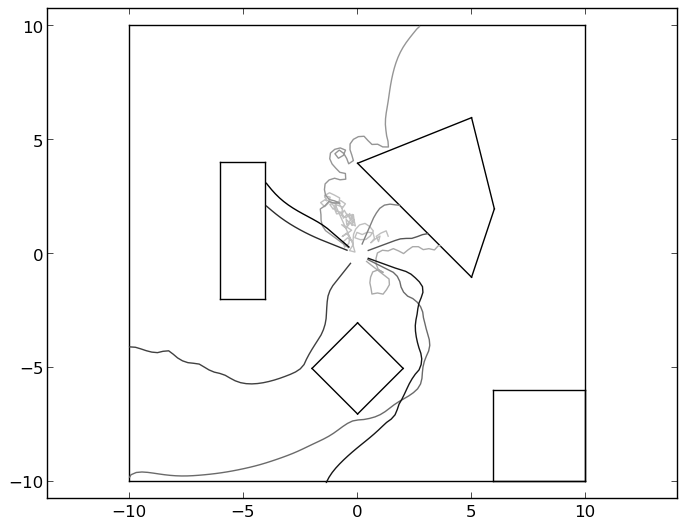

.. _epuck:

ePuck
=====

.. contents::

Introduction
------------

.. automodule:: HDPy.epuck

Example
-------

.. literalinclude:: ../../test/epuck_online.py

Reference
---------

.. module:: HDPy

.. autoclass:: HDPy.epuck.Robot
    :members: read_sensors, take_action, reset, reset_random, plot_trajectory

.. autoclass:: HDPy.epuck.AbsoluteRobot
    :show-inheritance:

.. autofunction:: HDPy.epuck.simulation_loop

.. autofunction:: HDPy.epuck.epuck_plot_snapshot

.. autofunction:: HDPy.epuck.epuck_plot_value_over_action

.. autofunction:: HDPy.epuck.epuck_plot_all_trajectories
