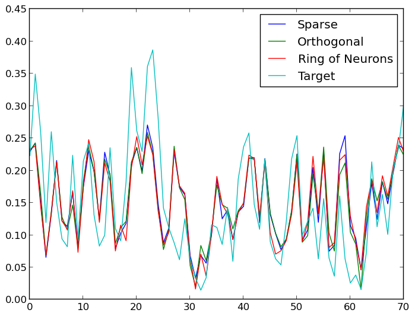

Reservoir Computing
===================

.. contents::

Introduction
------------

.. automodule:: HDPy.rc

Example
-------

.. literalinclude:: ../../test/rc_example.py

>>> Sparse         	0.004785	0.744121
>>> Orthogonal     	0.004858	0.749770
>>> Ring of Neurons	0.004827	0.747397

Reference
---------

.. module:: HDPy

.. autoclass:: ReservoirNode
    :members: execute, copy, input_dim, output_dim, reset, save, _post_update_hook, __call__

.. autoclass:: PlainRLS
    :members: train, __call__, save, stop_training, copy

.. autoclass:: StabilizedRLS
    :members:
    :show-inheritance:

.. autofunction:: sparse_reservoir
.. autofunction:: dense_w_in
.. autofunction:: sparse_w_in
.. autofunction:: dense_w_bias
.. autofunction:: orthogonal_reservoir
.. autofunction:: chain_of_neurons
.. autofunction:: ring_of_neurons

.. autofunction:: reservoir_memory
.. autofunction:: find_radius_for_mc

